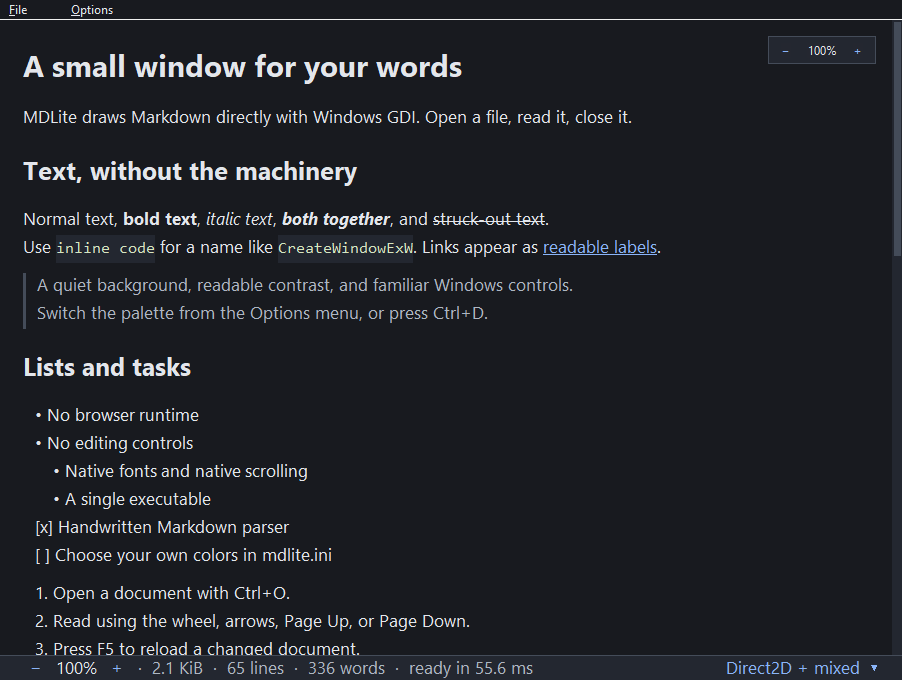

# MDLite

A read-only Markdown viewer for Windows. Written in Rust against the Win32 API
directly: no crates, no browser engine, no GUI framework, no bundled fonts. One
executable of about 430 KiB that opens a file, draws it, and stays out of the
way.



- **Three text pipelines, chosen per block.** GDI for Latin, GDI+ for Greek,
  Cyrillic and CJK, Direct2D for Arabic, Hebrew, Indic and Thai. Colour emoji
  are drawn glyph by glyph inside whichever pipeline drew the sentence. The
  footer names the one in use and explains why.
- **Markdown**: headings, emphasis, code, fenced blocks, lists, task marks,
  quotes, rules, links, image labels, and pipe tables with per-column alignment.
- **Colours you own.** Named palettes live in an INI beside the executable and
  are edited in a settings window. The whole window follows the one you pick —
  title bar, menus, scrollbar, footer.
- **Reading comfort**: smooth scrolling, text zoom from 50% to 400%, per-monitor
  DPI, and a scrollbar drawn in your own colours.

## Run

Requires 64-bit Windows 10 version 1703 or later. No installer, no
administrator rights, no runtime to install first.

```powershell
.\dist\mdlite.exe .\examples\showcase.md
```

Or open it and drop a document on the window.

| | |
| --- | --- |
| Open, reload | Ctrl+O, F5 |
| Scroll | Wheel, arrows, Page Up/Down, Space, Home/End |
| Text size | Ctrl+wheel, Ctrl+plus / Ctrl+minus / Ctrl+0 |
| Next palette | Ctrl+D |
| Settings, reread the INI | Ctrl+, and Ctrl+F5 |

## Build

Install stable Rust with a Windows toolchain, then:

```powershell
.\build.ps1 -Test
```

That runs the tests, builds offline, draws the icon, and puts `mdlite.exe` in
`dist`. There is nothing to download: the project has no dependencies.

## Documentation

- [How it works](docs/design.md) — the three pipelines, the palette and INI
  format, the Markdown subset, and the limits that keep a hostile file from
  taking the process down.
- [What was measured](docs/validation.md) — timings, memory, and what each
  test actually proves.

## License

MIT. See [LICENSE](LICENSE).
